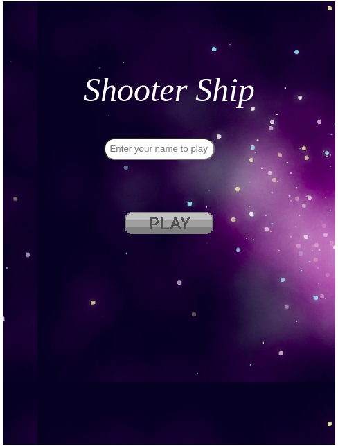
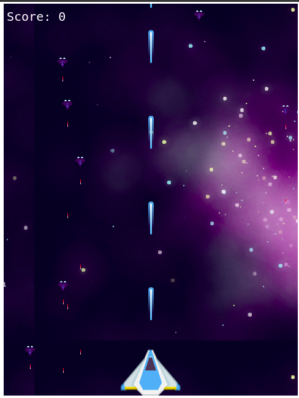
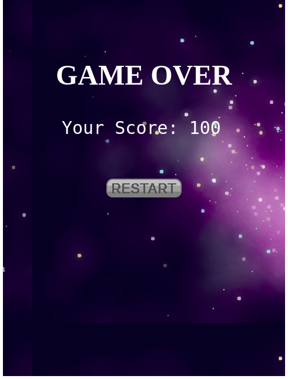

# Shooter Ship


>Shooter ship is a game built with phaser 3 where a giant ship shoots to destroy many alien ships that have attacked the planet. Giant player ship can destroy as many Alien ships as possible within a limitted time period.

## Screenshots

### Start



### Game Play



### Game Over



## Live Demo Link

[Play Live](https://priceless-khorana-be5fe5.netlify.app/)


## Getting started

Clone or fork the source code into your local machine
```
git clone https://github.com/Byabasaija/The-shooter.git
```
```cd``` into the cloned directory using
```
cd directory-name/
```

Open the directory in your favorite code editor e.g if your using Vs code
```
code .
```

To install dependencies run
``` 
npm install
 ```

To open the game in your browser run 
```
npm start
```

## Running tests

In the root directory, run

```
npm run test
```


## How to play

- First input your name in the textbox that appears in the middle of the screen.
- Then press play button.
- Press the spacebar to shoot.
- Move your ship by using arrow buttons from your keyboard.
- Try to shoot as many alien ships  as possible to get the highest score.

## Built With

- HTML 
- CSS
- Linter
- JS
- Webpack
- VScode
- Phaser

## Initial Objectives
At the beginning of this project, i wanted to give my giant shooter shooter ship the ability to release a massive weapon, like a bomb that can destroy many alien ships at a once.
At the end i didnot implement this because it required more tecnicality which would require me to do further reading yet i had less time.

## Acknowledgements

I used  Sprites from
- [Inspire To Educate](http://inspiredtoeducate.net/)
- [York Computer Solutions LLC](https://learn.yorkcs.com/)


## Author
**Pascal Byabasaija**
- Linkedin: [Pascal Byabasaija](https://www.linkedin.com/in/pascal-byabasaija/)
- Github: [@Byabasaija](https://github.com/Byabasaija)


## 🤝 Contributions

Contributions, issues and feature requests are welcome!

Feel free to check the [issues page](issues/).


## Show your Support
Give a ⭐ if you like this project!
