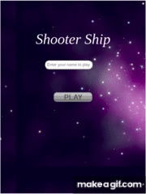

# Shooter Ship


## Description

A certain planet has been invaded by aliens. The invasion has been detected and a giant shooter ship has been sent to space to shoot the alien ships down before they cross the space to reach the plannet. Alien lasers cannot destroy the shooter ship because it was designed specifically for the purpose. However, the shooter is given limited time in space therefore he must shoot very fast and must make sure he shoots as many alien ships as possible.


### Visual representation




## Live Demo Link

[Play Live](https://priceless-khorana-be5fe5.netlify.app/)
### Gameplay

To play the game follow the instruction below:

**Movement instruction:**
- Player can use the `left` (&#8592;) arrow key to move left.
- Player can use the `right` (&#8594;) arrow key to move right.
- Player can use the `up` (&#8593;) arrow key to move up.
- Player can use the `down` (&#8595;) arrow key to move down.

**Battle instruction**
- Player can use the `space bar` to shoot down enemy ships.
- Enemey ships can shoot lasers but cannot destroy the player because the player is there to shoot down as many alien ships as he can before they cross the space
- The player has to shoot as many enemy ships as he can to earn more points.

**Leaderboard**
- To view the leaderboard, the player should click on the leaderboard image displayed when the game is over.

## To get the game running on your local machine

Clone or fork the source code into your local machine
```
git clone https://github.com/Byabasaija/The-shooter.git
```
```cd``` into the cloned directory using
```
cd directory-name/
```

Open the directory in your favorite code editor e.g if your using Vs code
```
code .
```

To install dependencies run
``` 
npm install
 ```

To open the game in your browser run 
```
npm start
```

## Running tests

In the root directory, run

```
npm run test
```

## Built With

- HTML 
- CSS
- Linter
- JS
- Webpack
- VScode
- Phaser

## Initial Objectives
At the beginning of this project, i wanted to give my giant shooter shooter ship the ability to release a massive weapon, like a bomb that can destroy many alien ships at a once.
At the end i didnot implement this because it required more tecnicality which would require me to do further reading and research yet i had less time.

## Acknowledgements

I used  Sprites from
- [Inspire To Educate](http://inspiredtoeducate.net/)
- [York Computer Solutions LLC](https://learn.yorkcs.com/)


## Author
**Pascal Byabasaija**
- Linkedin: [Pascal Byabasaija](https://www.linkedin.com/in/pascal-byabasaija/)
- Github: [@Byabasaija](https://github.com/Byabasaija)


## 🤝 Contributions

Contributions, issues and feature requests are welcome!

Feel free to check the [issues page](issues/).


## Show your Support
Give a ⭐ if you like this project!
